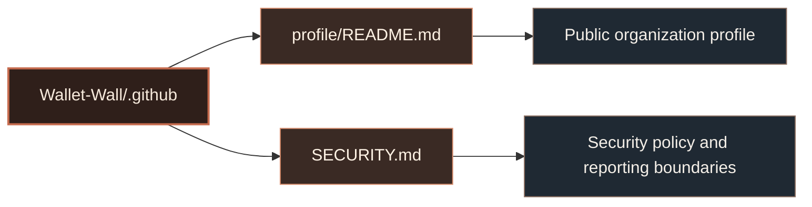

# WalletWall GitHub Metadata

This repository contains public GitHub organization metadata for `Wallet-Wall`.

It is separate from the WalletWall application codebase.

> [!IMPORTANT]
> This repository is public. Do not add private application code, deployment details, credentials, API keys, seed phrases, private keys, wallet recovery material, or sensitive wallet ownership information.

---

## Repository purpose

The `.github` repository currently manages two public-facing files:



---

## Contents

| Path                | Purpose                                                              |
| ------------------- | -------------------------------------------------------------------- |
| `profile/README.md` | Public organization profile shown on the WalletWall GitHub org page. |
| `SECURITY.md`       | Organization-level security policy and public reporting boundaries.  |

> [!NOTE]
> `profile/README.md` controls the public organization homepage at `https://github.com/Wallet-Wall`. This root README only explains the `.github` metadata repo itself.

---

## Public boundary

This repository may contain:

* Public organization profile content
* Public security policy
* Public-safe diagrams
* Public-safe markdown notes

This repository must not contain:

* Private WalletWall application source code
* Private infrastructure details
* API keys or credentials
* Environment files
* Deployment secrets
* Seed phrases or private keys
* Wallet recovery material
* Sensitive wallet ownership claims
* Internal roadmaps that should not be public

> [!CAUTION]
> Treat every file in this repository as externally visible and indexable.

---

## Maintenance principles

WalletWall public GitHub metadata should stay aligned with the project’s public positioning:

* Non-custodial wallet intelligence
* Holder behavior and whale activity analysis
* Stablecoin concentration research
* Coinstellation as the discovery layer
* Post-quantum wallet readiness research
* Clear separation between public research and private production systems

> [!TIP]
> Prefer careful public language such as “wallet readiness,” “exposure modeling,” “migration-path research,” “public wallet context,” and “non-custodial analysis.”

---

## Security language

WalletWall should never imply that public wallet analysis requires:

* Seed phrases
* Private keys
* Recovery phrases
* Custodial transfer of assets
* Unsafe wallet signatures
* Blind transaction approval

> [!IMPORTANT]
> If public wording appears to imply custody, private-key access, seed phrase collection, or unsafe signing requirements, update the wording before merging.

---

## Updating the organization profile

To update the WalletWall public GitHub organization profile, edit:

```txt
profile/README.md
```

Changes to that file appear on:

```txt
https://github.com/Wallet-Wall
```

To update this repository’s own README, edit:

```txt
README.md
```

---

## Suggested file structure

```txt
.github/
├─ README.md
├─ SECURITY.md
└─ profile/
   └─ README.md
```

---

## Status

This repository is maintained as public organization metadata for WalletWall.

Public materials may describe research, selected product surfaces, and security boundaries. They should not be treated as a complete representation of the private production application.

<sub>WalletWall is a non-custodial intelligence and research project. Public materials should not be interpreted as financial, legal, or security guarantees.</sub>
