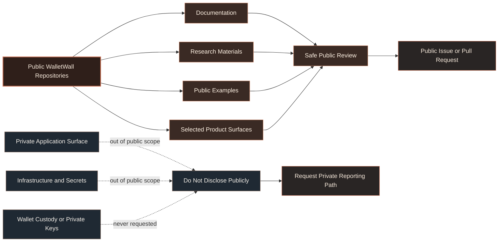

# Security Policy

WalletWall is a non-custodial wallet intelligence and research project.

WalletWall does not custody funds, request seed phrases, require private keys, or ask users to sign unsafe transactions for analysis.

> [!IMPORTANT]
> WalletWall analysis should never require seed phrases, private keys, recovery phrases, custodial transfer of assets, or unsafe wallet signatures.

---

## Security boundary



---

## Scope

This policy applies to public repositories in the `Wallet-Wall` GitHub organization, including public documentation, public research materials, example reports, and selected product surfaces.

Public security reports may relate to:

* Public repository content
* Public documentation
* Public research materials
* Broken or misleading security guidance
* Non-custodial wallet analysis flows
* Research boundaries around post-quantum wallet readiness
* Public examples that accidentally imply custody, signing authority, or wallet control

Private application code, infrastructure, API keys, credentials, deployment details, and internal operational systems are not part of the public repository surface.

> [!NOTE]
> Public repositories may contain research, prototypes, documentation, or selected product surfaces. They should not be assumed to represent the full private production application.

---

## Do not submit sensitive material

Please do not submit:

* Seed phrases
* Private keys
* Wallet recovery material
* API keys or credentials
* Sensitive personal data
* Sensitive wallet ownership claims
* Private infrastructure details
* Live exploit payloads against third-party systems
* Attempts to access private WalletWall systems or infrastructure

If a report requires sensitive detail, do not place that information in a public issue, pull request, discussion, or comment.

> [!CAUTION]
> Never paste seed phrases, private keys, API keys, credentials, wallet recovery material, or private infrastructure details into a public GitHub issue, pull request, discussion, or comment.

---

## Reporting public issues

For non-sensitive security questions or documentation concerns, open a GitHub issue in the relevant public repository.

Good public issue topics include:

* Security wording corrections
* Broken documentation links
* Unclear non-custodial boundaries
* Misleading research language
* Public example reports that need safer wording
* Questions about public research assumptions

Do not open public issues containing secrets, private keys, seed phrases, exploit steps against live systems, or sensitive wallet ownership information.

> [!TIP]
> If the concern is about public wording, diagrams, examples, or research framing, a normal GitHub issue is usually fine.

---

## Reporting sensitive concerns

For sensitive security concerns, do not disclose details publicly.

Use a private reporting path when available. If no private reporting path is available yet, open a minimal public issue asking for a private contact method without including sensitive details.

Example:

```txt
I have a sensitive security concern related to a public WalletWall repository. Please provide a private reporting path.
```

> [!IMPORTANT]
> A sensitive report should describe the need for private contact without exposing exploit details, secrets, wallet ownership claims, or credentials in public.

---

## Research boundaries

WalletWall public research may discuss wallet exposure, migration readiness, post-quantum risks, verifier feasibility, attestation flows, and vault-readiness patterns.

Unless explicitly stated otherwise, public research and prototypes should be treated as experimental.

WalletWall public research is not:

* Financial advice
* Legal advice
* Custody infrastructure
* A guarantee of wallet safety
* A claim that any specific wallet is compromised
* A recommendation to move funds without independent review
* A production security certification

> [!NOTE]
> WalletWall research focuses on wallet-level exposure, readiness signals, and migration-path design. It does not claim that any specific wallet is compromised.

---

## Non-custodial boundary

WalletWall should not require users to give up control of funds for wallet analysis.

WalletWall analysis should never require:

* Seed phrases
* Private keys
* Recovery phrases
* Custodial transfer of assets
* Unsafe wallet signatures
* Blind transaction approval

If any public documentation appears to imply otherwise, please report it.

> [!IMPORTANT]
> Non-custodial means WalletWall should help explain wallet context without taking custody, requesting secrets, or requiring unsafe signing behavior.

---

## Post-quantum readiness language

WalletWall uses careful language around post-quantum wallet readiness.

Preferred terms include:

* Wallet exposure
* Readiness signals
* Migration-path research
* Non-custodial analysis
* Public wallet context
* Verifier boundaries
* Attestation research

Avoid overclaiming that a wallet is compromised, guaranteed safe, or guaranteed unsafe without clear public evidence.

> [!TIP]
> Prefer “readiness,” “exposure,” and “migration-path research” over urgent or absolute language unless the claim is directly supported by public evidence.

---

## Safe harbor

WalletWall welcomes good-faith reports that improve the safety, clarity, and accuracy of its public repositories.

Good-faith research should:

* Avoid privacy violations
* Avoid service disruption
* Avoid accessing private systems
* Avoid exposing secrets
* Avoid moving or attempting to move funds
* Stay within public repositories and public documentation unless a private reporting path explicitly authorizes otherwise

> [!WARNING]
> Good-faith research does not include attempts to access private systems, disrupt services, extract secrets, move funds, or test live wallet-signing behavior without explicit authorization.

---

## Response expectations

WalletWall is in active development, and response times may vary.

Security reports will be reviewed based on severity, clarity, reproducibility, and relevance to the public repository surface.

<sub>WalletWall is a non-custodial intelligence and research project. Public materials should not be interpreted as financial, legal, or security guarantees.</sub>
