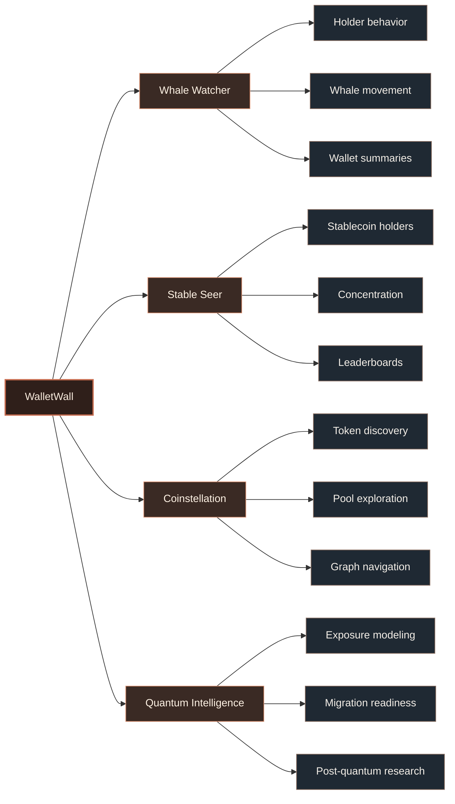

<h1>WalletWall</h1>

  <strong>Wallet intelligence for holder behavior, stablecoin concentration, whale activity, and post-quantum wallet readiness.</strong>

  
  
  
  

---

## Product journey

```mermaid
flowchart LR
    start[Start with an address, token, pool, or holder list]

    start --> discover[Discover relationships]
    discover --> coinstellation[Coinstellation]

    coinstellation --> wallet[Open wallet context]
    wallet --> whaleWatcher[Whale Watcher]
    wallet --> stableSeer[Stable Seer]

    whaleWatcher --> behavior[Holder behavior and whale movement]
    stableSeer --> concentration[Stablecoin concentration and leaderboards]

    behavior --> readiness[Assess wallet readiness]
    concentration --> readiness

    readiness --> quantumIntel[Quantum Intelligence]
    quantumIntel --> outcomes[Monitor, research, or prepare migration path]

    classDef entry fill:#2F1F1A,stroke:#C66B4E,color:#F7EADC,stroke-width:2px
    classDef discovery fill:#3A2A24,stroke:#D98F6F,color:#FFF3E5,stroke-width:1px
    classDef surface fill:#1F2933,stroke:#8B6F61,color:#F4EFE8,stroke-width:1px
    classDef outcome fill:#292524,stroke:#C66B4E,color:#F7EADC,stroke-width:1px

    class start entry
    class discover,coinstellation discovery
    class wallet,whaleWatcher,stableSeer,behavior,concentration,readiness,quantumIntel surface
    class outcomes outcome
```

---

## System map

---

## Operating principles

> [!IMPORTANT]
> WalletWall is non-custodial by design. Wallet analysis should never require seed phrases, private keys, or unsafe signatures.

> [!NOTE]
> Public research and product surfaces are separated. Vault and verifier work should be treated as research unless explicitly marked otherwise.

> [!TIP]
> Coinstellation is the discovery layer. Wallet-level context should resolve into Whale Watcher, Stable Seer, or Quantum Intelligence depending on the source context.

---

## Product surfaces

| Surface                  | Focus                                                                                       |
| ------------------------ | ------------------------------------------------------------------------------------------- |
| **Whale Watcher**        | Wallet-level holder intelligence, whale activity, and large-wallet behavior.                |
| **Stable Seer**          | Stablecoin holder analysis, concentration patterns, leaderboards, and distribution signals. |
| **Coinstellation**       | Token, pool, and wallet discovery through graph-based exploration.                          |
| **Quantum Intelligence** | Wallet-level exposure, migration readiness, and post-quantum research framing.              |

---

## Public repositories

| Repository                                                                              | Purpose                                                                                                        | State             |
| --------------------------------------------------------------------------------------- | -------------------------------------------------------------------------------------------------------------- | ----------------- |
| [**walletwall-vault**](https://github.com/Wallet-Wall/walletwall-vault)                 | Post-quantum wallet migration research, verifier feasibility, attestation flows, and vault-readiness patterns. | `research`        |
| [**walletwall-whale-watcher**](https://github.com/Wallet-Wall/walletwall-whale-watcher) | Public Whale Watcher workspace and wallet-intelligence surface.                                                | `product surface` |
| [**.github**](https://github.com/Wallet-Wall/.github)                                   | Public organization profile and shared community defaults.                                                     | `metadata`        |

---

## Research direction

WalletWall is researching practical wallet migration paths for a post-quantum environment.

The work focuses on:

* wallet-level exposure modeling
* clear user-facing risk language
* non-custodial migration readiness
* verifier and attestation boundaries
* research-to-product separation

> [!NOTE]
> WalletWall research focuses on wallet-level exposure, readiness signals, and migration-path design. It does not claim that any specific wallet is compromised.

The research is not financial advice, custody infrastructure, or a claim that any specific wallet is compromised. It is a framework for understanding public wallet exposure and preparing safer migration paths.

---

## Security posture

| Boundary              | Position                                                                                               |
| --------------------- | ------------------------------------------------------------------------------------------------------ |
| **Custody**           | WalletWall does not custody funds.                                                                     |
| **Secrets**           | WalletWall does not request seed phrases or private keys.                                              |
| **Signing**           | WalletWall does not require unsafe transaction signing for wallet analysis.                            |
| **Research boundary** | Experimental vault and verifier work should be treated as research unless explicitly marked otherwise. |

> [!IMPORTANT]
> WalletWall does not request seed phrases, private keys, or unsafe wallet signatures for analysis.

---

## Links

| Destination    | URL                                                     |
| -------------- | ------------------------------------------------------- |
| App            | https://walletwall.org                                  |
| Docs           | https://docs.walletwall.org                             |
| Vault research | https://github.com/Wallet-Wall/walletwall-vault         |
| Whale Watcher  | https://github.com/Wallet-Wall/walletwall-whale-watcher |

---

## Status

WalletWall is in active development.

Public repositories may represent research, prototypes, or standalone product surfaces while the main application continues to evolve.

> [!TIP]
> Public repositories may represent research, prototypes, or standalone product surfaces while the main application continues to evolve.

WalletWall is a non-custodial intelligence and research project. Public materials should not be interpreted as financial, legal, or security guarantees.
