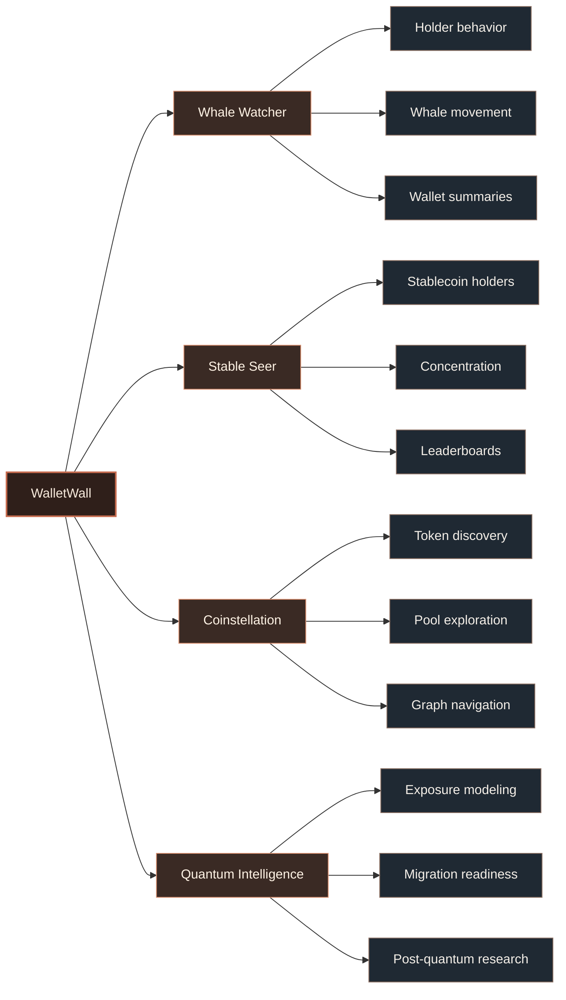

````md
<div align="center">

# WalletWall

**Wallet intelligence for holder behavior, stablecoin concentration, whale activity, and post-quantum migration readiness.**

[](#status)
[](#research-direction)
[](#security-posture)
[](https://docs.walletwall.org)

</div>

---

## System map



---

## Product surfaces

<table>
  <tr>
    <td width="25%"><strong>Whale Watcher</strong></td>
    <td>Wallet-level holder intelligence, whale activity, and large-wallet behavior.</td>
  </tr>
  <tr>
    <td><strong>Stable Seer</strong></td>
    <td>Stablecoin holder analysis, concentration patterns, leaderboards, and distribution signals.</td>
  </tr>
  <tr>
    <td><strong>Coinstellation</strong></td>
    <td>Token, pool, and wallet discovery through graph-based exploration.</td>
  </tr>
  <tr>
    <td><strong>Quantum Intelligence</strong></td>
    <td>Wallet-level exposure, migration readiness, and post-quantum research framing.</td>
  </tr>
</table>

---

## Public repositories

<table>
  <tr>
    <th align="left">Repository</th>
    <th align="left">Purpose</th>
    <th align="left">State</th>
  </tr>
  <tr>
    <td><strong>walletwall-vault</strong></td>
    <td>Post-quantum wallet migration research, verifier feasibility, attestation flows, and vault-readiness patterns.</td>
    <td><code>research</code></td>
  </tr>
  <tr>
    <td><strong>walletwall-whale-watcher</strong></td>
    <td>Public Whale Watcher workspace and wallet-intelligence surface.</td>
    <td><code>product surface</code></td>
  </tr>
  <tr>
    <td><strong>.github</strong></td>
    <td>Public organization profile and shared community defaults.</td>
    <td><code>metadata</code></td>
  </tr>
</table>

---

## Research direction

WalletWall is researching practical wallet migration paths for a post-quantum environment.

The work focuses on:

```txt
wallet-level exposure modeling
clear user-facing risk language
non-custodial migration readiness
verifier and attestation boundaries
research-to-product separation
```

The research is not financial advice, custody infrastructure, or a claim that any specific wallet is compromised. It is a framework for understanding public wallet exposure and preparing safer migration paths.

---

## Security posture

<table>
  <tr>
    <td><strong>Custody</strong></td>
    <td>WalletWall does not custody funds.</td>
  </tr>
  <tr>
    <td><strong>Secrets</strong></td>
    <td>WalletWall does not request seed phrases or private keys.</td>
  </tr>
  <tr>
    <td><strong>Signing</strong></td>
    <td>WalletWall does not require unsafe transaction signing for wallet analysis.</td>
  </tr>
  <tr>
    <td><strong>Research boundary</strong></td>
    <td>Experimental vault and verifier work should be treated as research unless explicitly marked otherwise.</td>
  </tr>
</table>

---

## Links

| Destination | URL |
| --- | --- |
| App | https://walletwall.org |
| Docs | https://docs.walletwall.org |
| Vault research | https://github.com/Wallet-Wall/walletwall-vault |
| Whale Watcher | https://github.com/Wallet-Wall/walletwall-whale-watcher |

---

## Status

WalletWall is in active development.

Public repositories may represent research, prototypes, or standalone product surfaces while the main application continues to evolve.

<sub>WalletWall is a non-custodial intelligence and research project. Public materials should not be interpreted as financial, legal, or security guarantees.</sub>
````
